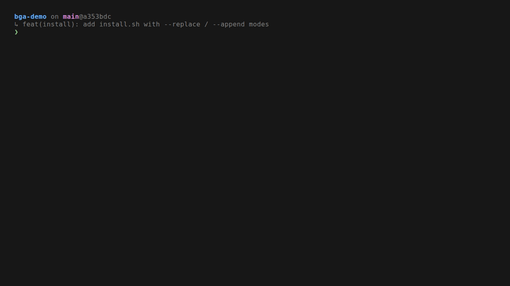

# bash-gitaware

A modern, modular, git-aware bash prompt. Two-line layout, tiered glyphs that
do not break on a non-Nerd-Font terminal, OSC 133 semantic prompt marks,
transient prompt, async rendering. Pure bash 4.4+, zero dependencies,
~500 lines of source split across 12 modules.



> **What this is.** A `.bashrc` that surfaces the context you actually need
> (where am I, which branch, dirty?, ahead/behind, runtime+version, last
> command duration, exit code) without cluttering every prompt, without
> tofu on terminals that lack fancy glyphs, and without slowing the shell
> down on a large repo. It is also a small, readable codebase: a SPEC, six
> ADRs, a render-pipeline diagram, tests, and CI. The whole thing fits in
> a ten-minute read.

Status: v2 release candidates. Tagged `v2.0.0-rc.1` (transient), `v2.0.0-rc.2`
(async), `v2.0.0-rc.3` (demo + install.sh + README rewrite). `v2.0.0` lands
with the CI matrix and a GitHub Release (M7).

[Documentation](docs/SPEC.md) · [Decisions](docs/adr/) · [Changelog](CHANGELOG.md)
· [Repo](https://github.com/SzematPro/bash-gitaware)

---

## Table of contents

- [What you see](#what-you-see)
- [Install](#install)
- [Prompt anatomy](#prompt-anatomy)
- [Configuration](#configuration)
- [Presets](#presets)
- [Module reference](#module-reference)
- [Compatibility](#compatibility)
- [Performance](#performance)
- [Customization](#customization)
- [Troubleshooting](#troubleshooting)
- [Repository layout](#repository-layout)
- [Contributing](#contributing)
- [License](#license)

---

## What you see

The animated demo above shows a typical sequence: enter a clean repo, touch
a file (dirty marker appears), `git stash` (stash count), a slow command
(timer), a failed command (red prompt + exit code), leave the repo (simple
prompt). The same flow in ASCII, for terminals where the GIF is not
inlined:

```
~/projects/bash-gitaware on main@74fd6cf
↳ feat(install): add install.sh with --replace / --append modes
❯ git status
On branch main
nothing to commit, working tree clean

~/projects/bash-gitaware on main@74fd6cf
↳ feat(install): add install.sh with --replace / --append modes
❯ printf 'x' > note.txt

~/projects/bash-gitaware on main@74fd6cf ●
↳ feat(install): add install.sh with --replace / --append modes
❯ git stash

~/projects/bash-gitaware on main@74fd6cf ≡1
↳ feat(install): add install.sh with --replace / --append modes
❯ sleep 3; false
took 3s ✘1
↳ feat(install): add install.sh with --replace / --append modes
❯
```

Outside a git tree, the prompt collapses to its essentials:

```
~/Documents
❯
```

Inside a Node / Python / Rust / Go project, the toolchain shows up next to
the git block:

```
~/projects/myapp on main@a1b2c3d via  node v20.11.0
↳ chore: bump deps
❯
```

A non-zero exit colors the prompt symbol red and adds `✘N`:

```
~/projects/myapp on main@a1b2c3d
↳ chore: bump deps
took 4s ✘2
↳ chore: bump deps
❯
```

After `Enter`, the previous prompt collapses to a one-line form in the
scrollback:

```
❯ git status
On branch main
...
❯ printf 'x' > note.txt
❯ git stash
Saved working directory and index state ...
❯
```

---

## Install

### Quick install (recommended)

```bash
git clone https://github.com/SzematPro/bash-gitaware ~/.bash-gitaware
cd ~/.bash-gitaware
./install.sh            # replaces ~/.bashrc (creates a timestamped backup first)
exec bash               # or: open a new terminal
```

### Append instead of replace

If you have an existing `~/.bashrc` you want to keep, append a `source` line
instead:

```bash
./install.sh --append   # idempotent; safe to run twice
exec bash
```

The script:

- Warns (does not refuse) if your `bash` is older than 4.4. macOS ships
  bash 3.2 by default; install a modern bash with
  `brew install bash && chsh -s "$(brew --prefix)/bin/bash"`.
- Backs up `~/.bashrc` to `~/.bashrc.bak-<unix-ts>` before `--replace`.
  Skip with `--no-backup`.
- Accepts `--target FILE` for testing (write somewhere other than
  `$HOME/.bashrc`).

See `./install.sh --help` for all flags.

### Try without installing

```bash
bash --rcfile new.bashrc -i
```

A throwaway interactive shell with the prompt loaded; nothing in your dotfiles
is touched.

---

## Prompt anatomy

The prompt is **two lines** by default, with an optional middle line for the
last commit subject:

```
[chroot] [container] [user@host ] path[ on branch[@hash][ STATE][ ↑ahead][ ↓behind][ ●][ ≡stash][ via runtime ...][ took duration][ ✘exit]]
↳ last commit subject
❯
```

Every element is **conditional**. Most prompts use only a small subset of it.

| Element | When | Notes |
|---|---|---|
| `[chroot]` | `$debian_chroot` is set | Amber tag |
| `[container]` | Running in Docker / Podman / LXC | Detected once at shell startup via `/.dockerenv`, `/run/.containerenv`, `/proc/1/cgroup` |
| `user@host` | SSH session OR running as root (or always if `BASHGITAWARE_SHOW_HOST=always`) | Host in bold amber over SSH |
| `path` | Always | Repo-relative inside a git work tree (`repo-name + path-within-repo`); `~`-relative under `$HOME`; trimmed to the last `BASHGITAWARE_PATH_MAXDEPTH` components (default 3) with a leading `…` |
| `on branch` | Inside a git work tree | Branch label from `.git/HEAD` (no `git status` needed on the cheap path) |
| `@hash` | Branch is a real branch (not detached) | First 7 chars of the commit oid |
| `STATE` | Mid-operation | `REBASE n/m`, `AM n/m`, `MERGING`, `CHERRY-PICK`, `REVERTING`, `BISECTING` — filesystem checks only |
| `↑N` / `↓N` | Local has unpushed commits / remote has commits we lack | Async — appears on the next prompt cycle on a large repo |
| `●` | Working tree has changes (tracked or untracked) | Async — same |
| `≡N` | `git stash` has N entries | Sync, gated by `.git/refs/stash` existing |
| `via runtime` | Node / Python / Rust / Go project marker in `$PWD` | Cached per `(PWD, VIRTUAL_ENV, CONDA_DEFAULT_ENV)` |
| `took Ns` | Last command took ≥ `BASHGITAWARE_TIMER_THRESHOLD` seconds (default 2) | Yellow, after the git/runtime block |
| `✘N` | Last command failed | Bold red, last on the line |
| `↳ subject` | Optional commit-line; `BASHGITAWARE_COMMIT_LINE=0` to hide | Truncated to `$COLUMNS - 3` with the configured ellipsis |
| `❯` | Always (the prompt symbol) | Bold green on success, bold red on failure; `>` on the ascii tier; `#` for root |

While the async path is computing on a large repo, a faint `…` (or `...` on
ascii) trails the branch info to signal "still working"; it clears on the
next prompt cycle.

After Enter, the previous prompt collapses to `❯ <typed-command>` (the
"transient prompt"). Disable with `BASHGITAWARE_TRANSIENT=0`.

---

## Configuration

All settings are environment variables. Export them before `~/.bashrc` is
sourced (e.g. in `/etc/profile`, `~/.profile`, or near the top of the file
itself).

| Variable | Default | Effect |
|---|---|---|
| `BASHGITAWARE_PRESET` | `default` | Coherent bundle of defaults — `minimal`, `default`, `powerline`, `full`. See [Presets](#presets). |
| `BASHGITAWARE_GLYPHS` | auto | Force a glyph tier: `nerd`, `unicode`, `ascii`. Auto picks `unicode` on a UTF-8 locale, else `ascii`. **Never auto-picks `nerd`** — a UTF-8 locale does not imply the font has Nerd glyphs. |
| `BASHGITAWARE_NERD_FONT` | `0` | Shorthand for `BASHGITAWARE_GLYPHS=nerd`. |
| `BASHGITAWARE_COMMIT_LINE` | `1` | Show the `↳ subject` line below the context line. `0` to hide. |
| `BASHGITAWARE_RUNTIME` | `1` | Show `via node` / `via python` / `via rust` / `via go` in language projects. `0` to hide. |
| `BASHGITAWARE_OSC` | `1` | Emit OSC 133 semantic marks (A/B/C/D) and OSC 7 cwd reports. `0` to suppress. |
| `BASHGITAWARE_TRANSIENT` | `1` | Collapse the previous prompt to `❯ <command>` on submit. `0` to disable. |
| `BASHGITAWARE_ASYNC` | `1` | Compute the expensive part of `git status` in the background and surface it on the next prompt. `0` to render fully synchronous. |
| `BASHGITAWARE_TIMER_THRESHOLD` | `2` | Show `took Ns` only when the command took at least N seconds. |
| `BASHGITAWARE_PATH_MAXDEPTH` | `3` | Trim the path to the last N components, with a leading `…`. `0` for unlimited. |
| `BASHGITAWARE_SHOW_HOST` | `auto` | `always` / `auto` / `never`. Auto = SSH session or root. |
| `NO_COLOR` | unset | Standard `NO_COLOR` (https://no-color.org). When set, the prompt renders in plain text. |

---

## Presets

A preset sets a coherent set of defaults; **individual `BASHGITAWARE_*`
variables still override** anything a preset sets (`:=` parameter expansion,
not `=`).

| Preset | Glyphs | Commit line | Runtime modules | User@host | Notes |
|---|---|---|---|---|---|
| `minimal` | `ascii` | off | off | auto | The cleanest look: ASCII-only, no commit line, no runtime modules. |
| `default` | auto | on | on | auto | Current behavior with no preset. UTF-8 unicode glyphs on a UTF-8 locale. |
| `powerline` | `nerd` | on | on | auto | Nerd Font glyphs on by default. Falls back gracefully if the font lacks them. The arrow-segment render style is planned for a future release; in v2 the preset is a glyph default. |
| `full` | auto | on | on | always | Everything. `user@host` is shown even on a local session. |

```bash
export BASHGITAWARE_PRESET=minimal
exec bash
```

---

## Module reference

The single-file `new.bashrc` is generated from twelve modules under `lib/`.
Edit the modules, run `make build`, commit the regenerated artifact. CI
verifies the artifact is current.

| Module | Responsibility |
|---|---|
| `lib/00-options.bash` | Read `BASHGITAWARE_*` knobs; apply presets via `${var:=value}` so user overrides win. |
| `lib/10-detect.bash` | Detect SSH session, container, UTF-8 locale, terminal title support, root, color capability — once at startup, not per prompt. |
| `lib/20-palette.bash` | 256-color palette + tiered glyph selection (`nerd` > `unicode` > `ascii`). |
| `lib/30-git.bash` | Cheap (sync) git info: rev-parse + filesystem state + branch label from `.git/HEAD`. Expensive (async) info compute function for the background job. |
| `lib/40-path.bash` | Repo-relative path inside a git work tree; `~`-relative outside; trim to `BASHGITAWARE_PATH_MAXDEPTH`. |
| `lib/50-runtime.bash` | Node / Python / Rust / Go detection + version, cached per `(PWD, VIRTUAL_ENV, CONDA_DEFAULT_ENV)`. |
| `lib/60-render.bash` | `__bga_prompt`: assemble PS1 from parts; emit OSC marks; record the transient state for `lib/80-transient.bash`. |
| `lib/70-osc.bash` | OSC 133 A/B/C/D semantic marks, OSC 7 cwd, OSC 0/2 window title. `BASHGITAWARE_OSC=0` short-circuits all of them. |
| `lib/80-transient.bash` | Collapse the previous prompt to `❯ <command>` on Enter, via `bind -x` + a readline macro on `\C-m`. |
| `lib/85-async.bash` | Spawn the background git-status subshell, parse its cache file defensively, install the EXIT trap. |
| `lib/90-hooks.bash` | Wire `PROMPT_COMMAND`, the DEBUG trap (command timer), and `__bga_async_init`. |
| `lib/95-shell.bash` | The non-prompt `.bashrc` bits: history, ls colors, aliases, completion, PATH. |

The build pipeline is `bin/build.sh`: it concatenates `lib/[0-9][0-9]-*.bash`
(stable sort) with a header line, writes `new.bashrc`, and CI fails the build
if the artifact in `git` differs from a fresh rebuild.

---

## Compatibility

| Platform | Bash | Status |
|---|---|---|
| Linux (any distro with a current bash) | 4.4, 5.0, 5.1, 5.2, latest | Supported. CI runs on `ubuntu-latest` today; full version matrix lands with `v2.0.0` (M7). |
| macOS with a modern bash (Homebrew, MacPorts) | 4.4+ | Supported. macOS ships bash 3.2 by default; install a current bash with `brew install bash`, then `chsh -s "$(brew --prefix)/bin/bash"`. |
| macOS with stock bash 3.2 | 3.2 | **Not supported.** Several features (`PS0`, parameter transformations) require 4.4+. See [ADR-0006](docs/adr/ADR-0006-bash-only-bash-44-plus.md). |
| zsh / fish / dash / ksh | — | **Not supported.** bash-gitaware is bash-native by design (`PS0`, `bind -x`, `PROMPT_COMMAND` shape, parameter transformations). |

OSC integration (`BASHGITAWARE_OSC=1`, default) targets modern terminals that
recognize OSC 133 / OSC 7 well-formed sequences: WezTerm, Kitty, VS Code's
integrated terminal, iTerm2, Ghostty, Konsole, Windows Terminal, Warp, foot,
Alacritty. Terminals that do not recognize the sequences ignore them — they
are well-formed OSC and never corrupt the screen.

---

## Performance

The synchronous render path costs **under 30 ms on a CI runner** for a small
repo with warm caches (measured: ~8 ms on the ubuntu-latest runner across
50 renders, well under the 80 ms budget).

The async path makes the *perceived* prompt time independent of repo size:
the cheap info renders immediately, the expensive `git status --porcelain=v2`
runs in a background subshell, and the prompt re-renders with full info on
the next cycle.

Subprocess budget per prompt:

| Where | Count |
|---|---|
| Outside a git tree | `0` git subprocesses |
| Inside a git tree, cheap path (default) | up to `3` (rev-parse + an optional `rev-parse HEAD` for packed-refs + `git log -1 --pretty=%s`) |
| Inside a git tree, sync path (`BASHGITAWARE_ASYNC=0`) | up to `4` (the cheap three plus the porcelain v2 status) |
| Stash | `1` extra when `.git/refs/stash` exists |
| Runtime version (Node / Python / Rust / Go) | `1` on the first prompt in a directory; `0` thereafter (per-`(PWD, VIRTUAL_ENV, CONDA_DEFAULT_ENV)` cache) |

Subprocesses are the expensive part. Filesystem checks (rebase state, container
detection, locale detection) cost nothing measurable.

---

## Customization

Themes:

- The color palette is in `lib/20-palette.bash`, organized by semantic name
  (`_c_path`, `_c_branch`, `_c_dirty`, ...) rather than raw color codes.
  Retheme by changing the mappings, not the prompt logic.
- The glyph sets are in the same file, in three tiers; add or change glyphs
  per tier and rebuild.

Layout:

- The two-line layout is built in `lib/60-render.bash`. Reorder, drop, or add
  elements there; rebuild with `make build`.
- A "powerline arrow-segment" structural render is planned but not yet shipped;
  the `powerline` preset is a glyph default in v2.

To make the build automatic after editing `lib/`:

```bash
make build      # regenerate new.bashrc
make test       # run the scenario + perf suite
make lint       # run shellcheck -x
make check      # build-freshness gate (CI uses this)
```

---

## Troubleshooting

**The symbols look broken (tofu, missing-glyph squares).** Your terminal
font does not have the Nerd Font / Powerline glyphs. The defaults are safe
(`unicode` tier on UTF-8 locales, `ascii` otherwise), so this usually means
you set `BASHGITAWARE_NERD_FONT=1` or `BASHGITAWARE_PRESET=powerline`
without a Nerd Font installed. Fix: `export BASHGITAWARE_GLYPHS=unicode`
and reload, or install a Nerd Font in your terminal.

**The prompt is misaligned after `Ctrl-C` or a terminal resize.** The
transient-prompt collapse uses the recorded line count of the just-shown
prompt; a resize between rendering and submit can put the cursor on the
wrong row. The next prompt re-syncs. Disable with
`BASHGITAWARE_TRANSIENT=0` if it bothers you.

**Dirty marker / ahead-behind appears one prompt late on a big repo.**
That is the async path doing its job. The expensive `git status` runs in
a background subshell and the full info shows up on the *next* prompt.
Disable with `BASHGITAWARE_ASYNC=0` for fully synchronous rendering.

**OSC sequences appear as literal text in my terminal.** Your terminal does
not recognize OSC 133. Disable with `BASHGITAWARE_OSC=0` (or upgrade to a
terminal that supports it; the list is in [Compatibility](#compatibility)).

**Colors look wrong.** Set `NO_COLOR=1` to disable all color. If the issue
is a specific element, the semantic palette is in `lib/20-palette.bash`.

**`make check` fails: "new.bashrc is out of date".** You edited `lib/`
without running `make build`. Run it, then commit the regenerated
`new.bashrc`.

---

## Repository layout

```
bash-gitaware/
├── new.bashrc              the generated single-file artifact (committed)
├── install.sh              install to ~/.bashrc (--replace or --append)
├── bin/build.sh            concatenate lib/*.bash into new.bashrc
├── Makefile                build / test / lint / check / demo
├── lib/                    canonical source, twelve modules
│   ├── 00-options.bash
│   ├── 10-detect.bash
│   ├── 20-palette.bash
│   ├── 30-git.bash
│   ├── 40-path.bash
│   ├── 50-runtime.bash
│   ├── 60-render.bash
│   ├── 70-osc.bash
│   ├── 80-transient.bash
│   ├── 85-async.bash
│   ├── 90-hooks.bash
│   └── 95-shell.bash
├── docs/
│   ├── SPEC.md             what v2 is (and is not)
│   ├── PLAN.md             milestones (M0..M7)
│   ├── adr/                six MADR architecture decisions
│   └── diagrams/           render-pipeline (Mermaid)
├── tests/
│   ├── run.sh              orchestrator
│   ├── lib.sh              assertion helpers
│   ├── scenarios.sh        rendering scenarios (69 asserts)
│   ├── perf.sh             80 ms render budget
│   └── MANUAL.md           interactive checklist
├── demo/                   vhs tape + generated GIF (`make demo` to regenerate)
└── .github/workflows/ci.yml
```

---

## Contributing

See [CONTRIBUTING.md](CONTRIBUTING.md). Workflow:

1. Edit `lib/[0-9][0-9]-*.bash`.
2. `make build` — regenerate `new.bashrc`.
3. `make test` — scenario + perf + freshness suite.
4. `make lint` — shellcheck `-x`.
5. Conventional Commits for messages; signed off with the project's identity
   (`SzematPro`).

For substantive design changes, add an ADR in `docs/adr/` following the MADR
template (`docs/adr/template.md`).

Security issues: [SECURITY.md](SECURITY.md). The repo has a low-attack-surface
threat model — branch names, commit subjects, and paths are inserted as data,
never re-evaluated.

---

## License

[MIT](LICENSE).

---

**Author**: Waldemar Szemat — `waldemar@szemat.pro` ·
[github.com/SzematPro](https://github.com/SzematPro)
