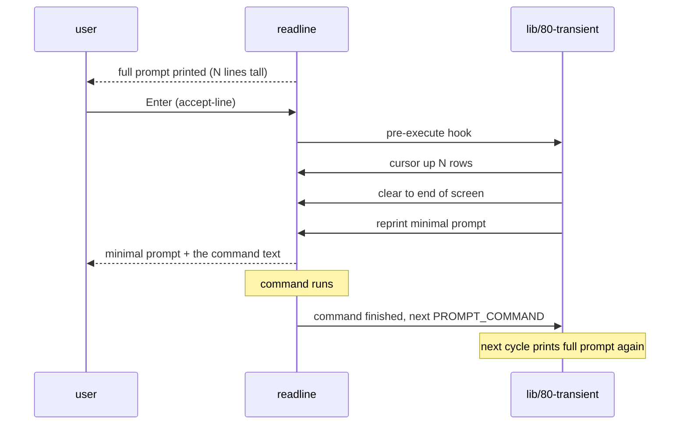

# Render pipeline

How a prompt is produced (synchronous path), how slow info is filled in
later (async path), and how the previous prompt collapses after submit
(transient path). Diagrams render natively on GitHub.

## 1. Synchronous prompt cycle

The path every prompt takes. Each named lane corresponds to a module under
`lib/`.

```mermaid
flowchart LR
  A["Enter pressed<br/>(or shell start)"] --> B["Capture $?<br/>and SECONDS"]
  B --> C["lib/90-hooks<br/>PROMPT_COMMAND fires"]
  C --> D["lib/00-options<br/>read knobs + apply preset"]
  D --> E["lib/10-detect<br/>ssh / container / utf-8 / color<br/>(cached after first call)"]
  E --> F["lib/40-path<br/>repo-relative path"]
  F --> G["lib/30-git<br/>cheap git info<br/>(rev-parse + fs state)"]
  G --> H["lib/50-runtime<br/>node / python / rust / go<br/>(per-dir cache)"]
  H --> I["lib/60-render<br/>assemble parts into PS1 string"]
  I --> J["lib/70-osc<br/>emit OSC 133 A/B + OSC 7"]
  J --> K["Assign PS1"]
  K --> L["readline reads PS1<br/>prompt drawn"]
```



See: [ADR-0001](../adr/ADR-0001-module-architecture-and-build-pipeline.md)
for the module split, [ADR-0003](../adr/ADR-0003-osc-133-and-osc-7-terminal-integration.md)
for the OSC emissions.

## 2. Async path

When the expensive info (full `git status`, cold-cache runtime version) is
not ready, the prompt is rendered immediately with cheap info plus a
placeholder; the slow work happens in a background subshell; the result is
read on the next prompt cycle.

```mermaid
sequenceDiagram
  participant U as user
  participant S as shell (PROMPT_COMMAND)
  participant B as background job
  participant T as temp file
  Note over S: prompt cycle starts
  S->>S: cheap render (path, rev-parse, cached runtime, placeholder)
  S-->>U: prompt shown (immediate)
  S->>B: fork: full git status + cold runtime version
  Note over U: user starts typing
  B->>T: write computed info
  B--xS: SIGUSR1 (best-effort)
  alt user submits a command first
    U->>S: Enter
    Note over S,B: previous job's result discarded;<br/>command runs
  else next prompt cycle reaches here
    S->>T: read computed info
    S-->>U: full prompt on next cycle
  end
```

Honest about the tradeoff: the refresh happens **on the next prompt**, not
in place on the line the user is currently editing. See
[ADR-0005](../adr/ADR-0005-async-rendering.md) for the rationale and the
limits accepted.

## 3. Transient path

The just-displayed prompt collapses to a minimal form (`❯ ` or `> ` in
ASCII) on submit; the live prompt is full, the history is compact.



See [ADR-0004](../adr/ADR-0004-transient-prompt.md) for the mechanism, the
edge cases handled, and the off switch.
